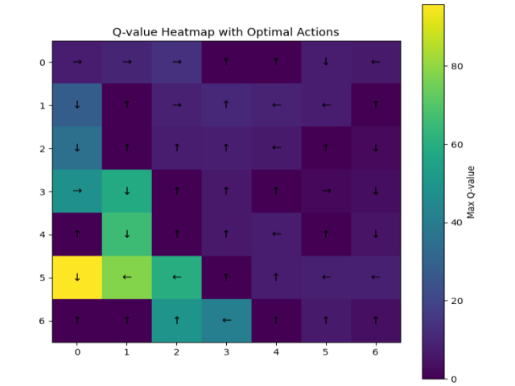

# Reinforcement Learning - 2024

## Description

This project implements reinforcement learning algorithms, including Value Iteration and Q-learning, with a focus on $\epsilon$-greedy and aggressive exploration strategies to enhance decision-making in uncertain environments. For more details, please refer to `./pdf/consignes.pdf`.

<p align="center">
  
  <br/>
  <strong>Instance of the best policy calculated after 10 000 steps for the introductive maze.</strong>
</p>


## Usage

Make sure you have `Python >= 3.11` installed.


## Features

- **Q-Learning and Value Iteration Implementations**: Algorithms designed to help the agent learn the optimal policy for navigating a maze.

- **Model Persistence**: Load and save trained models using `pickle`, allowing the agent to retain its training for future use.

- **Highly Configurable Parameters**: Easily adjust algorithm parameters to fine-tune performance. Refer to the `Usage` section for detailed instructions. 

## Install the Project

1. Clone the repository:
   ```bash
   git clone https://github.com/Ant0in/Projet4-IA.git
   ```

2. Navigate to the **project directory**:
   ```bash
   cd Projet4-IA/
   ```

3. Install **Poetry** (if not already installed):
   ```bash
   pip install poetry
   ```

4. **Install** the project dependencies using **Poetry**:
   ```bash
   poetry install
   ```

5. Activate the **virtual environment**:
   ```bash
   poetry shell
   ```

6. **Update** dependencies to their latest compatible versions *(Optional)*:
   ```bash
   poetry update
   ```

## Usage

...

## License

This project is licensed under the **MIT License**. You are free to use, modify, and distribute this software.

## Acknowledgements

This project was developed for the Artificial Intelligence course `INFO-F311`. Special thanks to `Tom Lenaerts & Pascal Tribel (ULB)` for their guidance and support.

